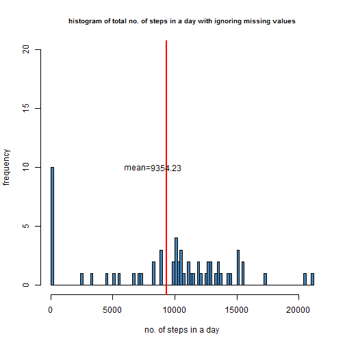
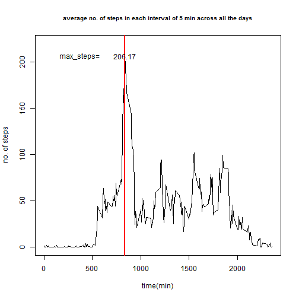
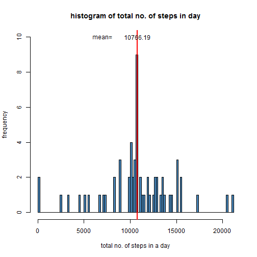
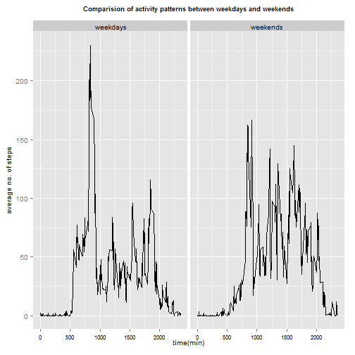

Sriharsha Surineni

## Loading and preprocessing the data
Loading the human activity data into the rawdata1 dataframe.


```r
rawdata1<-read.table("activity.csv", header=T, sep=",")
```

Loading all the packages which might be necessary for processing the data


```r
library(plyr)
library(reshape2)
```

```
## Warning: package 'reshape2' was built under R version 3.2.2
```

```r
library(ggplot2)
```

```
## Warning: package 'ggplot2' was built under R version 3.2.2
```

```
## Need help? Try the ggplot2 mailing list: http://groups.google.com/group/ggplot2.
```

```r
library(lubridate)
```

```
## Warning: package 'lubridate' was built under R version 3.2.2
```

```
## 
## Attaching package: 'lubridate'
## 
## The following object is masked from 'package:plyr':
## 
##     here
```


## What is mean total number of steps taken per day?

Lets continue with the loaded data. Lets have a glimpse of the data


```r
head(rawdata1)
```

```
##   steps       date interval
## 1    NA 2012-10-01        0
## 2    NA 2012-10-01        5
## 3    NA 2012-10-01       10
## 4    NA 2012-10-01       15
## 5    NA 2012-10-01       20
## 6    NA 2012-10-01       25
```

We can see there are missing values stored as nas in the data. As mentioned for the first part of the assignment, we will proceed with ignoring the missing values.


To calculate the total no. of steps taken per day throughout all the 5 min intervals, we will have to reshape the data and summarize it for each day. Here is the code chunk for the same :


```r
rd1<-ddply(rawdata1,.(date),summarize,total_steps=sum(steps,na.rm=T))
```


Here is the histogram of total no. of steps in a day:


```r
hist(rd1[,2],main="histogram of total no. of steps in a day with ignoring missing values",
     xlab="no. of steps in a day",   ylab="frequency",   breaks=150,    ylim=c(0,20),
     col="steelblue", cex.main=0.8)


mean1<-mean(rd1$total_steps)
median1<-median(rd1$total_steps)

t<-mean1-15
abline(v=mean1,col="red", lwd=2)
text(mean1, 10 ,round(mean(rd1$total_steps), 2))
text(7000,10,"mean=")
```

 


From the above data set, we obtain the **mean total no. of steps** taken in a day as: **9354.2295082**,
**median on total no. of steps** taken in a day as:  **10395**


## What is the average daily activity pattern?


Coming to the average daily activity pattern. Data has to reshaped again and summarized for average no of steps taken in a particular interval of 5 min across all days. Here is the code for reshaping the data:


```r
rd3<-ddply(rawdata1,.(interval),summarize,total_steps=mean(steps,na.rm=T))
```


Here is the time series plot representing average daily activity pattern:


```r
plot(rd3[,1],rd3[,2],main="average no. of steps in each interval of 5 min across all the days",
     xlab="time(min)", ylab="no. of steps", cex.main=0.8,type="l", ylim=c(0,220))


max_steps<-max(rd3[,2])
max_interval<-rd3[rd3[,2]==max_steps,1]

abline(v=max_interval,col="red",lwd=2)


text(max_interval,max_steps,round(max_steps,2))

text(370,max_steps,"max_steps=")
```

 


The interval containing the maximum no. of average steps taken is:  836


## Imputing missing values


**Lets look at the no. of missing values in our "rawdata":**


```r
nr<-is.na(rawdata1[,1])

no.of_nas<-sum(nr)
```


The total no.of missing values in the dataset is: 2304


Well, with such large number of missing values in the data, we will have to do something about them. Now, lets try replacing missing values with the mean value for that particular day and see how that pans out:


```r
df<-ddply(rawdata1,.(date),summarize,meansteps=mean(steps,na.rm=T))

head(df)
```

```
##         date meansteps
## 1 2012-10-01       NaN
## 2 2012-10-02   0.43750
## 3 2012-10-03  39.41667
## 4 2012-10-04  42.06944
## 5 2012-10-05  46.15972
## 6 2012-10-06  53.54167
```


Now, we will check whether there are any days, with all the data missing.


```r
nd<-is.na(df[,2])
no.of_nas<-sum(nd)
```

So, there are 8 days with all the data missing. So, it is better to replace the missing values with the mean of all the steps taken in that particular 5 min interval of all days. Here is the code for the same :


```r
df1<-ddply(rawdata1,.(interval),summarize,meansteps=mean(steps,na.rm=T))
ni<-is.na(df1[,2])
no.of_nas<-sum(ni)
```

There are 0 intervals with all the data missing. So, we will proceed with this strategy of replacing the missing values.


**Code for imputing missing values and creating new dataset "rawdata2":**


```r
rawdata2<-rawdata1

for(b in 1:17568){
       if(is.na(rawdata2[b,1])==T){
                x<-rawdata2[b,3]
                rawdata2[b,1]<-df1[df1[,1]==x,2]
       }}

head(rawdata2) 
```

```
##       steps       date interval
## 1 1.7169811 2012-10-01        0
## 2 0.3396226 2012-10-01        5
## 3 0.1320755 2012-10-01       10
## 4 0.1509434 2012-10-01       15
## 5 0.0754717 2012-10-01       20
## 6 2.0943396 2012-10-01       25
```

```r
nrd2<-is.na(rawdata2[,1])
```

The no. of missing values in the "rawdata2" is 0

We can proceed for further processing with this new data with no missing values.


Now, lets resummarize  the total no. of steps taken in a day with the new dataset. Here is the code for that:


```r
q1<-ddply(rawdata2,.(date),summarize,totalno.of._steps=sum(steps))
```


**Here is the histogram of total no. of steps taken in a day:**


```r
hist(q1$totalno.of._steps,xlab="total no. of steps in a day",
         ylab="frequency",   breaks=90,    ylim=c(0,10), 
         main="histogram of total no. of steps in day",
         col="steelblue", border="black"
)


mean2<-round(as.double(mean(q1[,2])),2)
median2<-round(as.double(median(q1[,2])),2)


abline(v=mean2,col="red", lwd=2)
text(mean2, 10 ,round(mean2, 2))
text(7000,10,"mean=")
```

 


**Average no. of steps** taken per day comes out to be **10766** for the new dataset and **median** is **10766**


**Mean** -    **data with missing values**:   **9354**
         - **data without missing values**:   **10766**
     
     
**Median**-   **data with missing values**:   **10395**
          -**data without missing values**:   **10766**
      
      
We can clearly see the difference in means and medians of the data before and after imputing the missing values. Imputing the missing values reduces the skewedness arising from ignoring the missing values.


## Are there differences in activity patterns between weekdays and weekends?


**Lets compare the activity pattern in between weekdays and weekends. Here is the code for introducing a factor variable differentiating weekdays from weekends: **


```r
wdays<-c("Monday","Tuesday","Wednesday","Thursday","Friday")
wends<-c("Saturday","Sunday")
rawdata2$date<-as.Date(rawdata2$date)

for(m in 1:17568){
     d<-weekdays(rawdata2[m,2])
     if(is.element(d,wdays)){rawdata2$day[m]<-"weekdays"} else{rawdata2$day[m]<-"weekends"}
}


rawdata2$day<-as.factor(rawdata2$day)


##qwd<-ddply(rawdata2,.(interval,day),summarize, average_steps=mean(steps))
```


  **Lets have a look at the rawdata2 with factor variable of weekdays:**


```r
head(rawdata2)
```

```
##       steps       date interval      day
## 1 1.7169811 2012-10-01        0 weekdays
## 2 0.3396226 2012-10-01        5 weekdays
## 3 0.1320755 2012-10-01       10 weekdays
## 4 0.1509434 2012-10-01       15 weekdays
## 5 0.0754717 2012-10-01       20 weekdays
## 6 2.0943396 2012-10-01       25 weekdays
```

```r
summary(rawdata2$day)
```

```
## weekdays weekends 
##    12960     4608
```
##
##
##
##
##


  **Here is the panel plot of comparision of average activity in between weekdays and weekends:**


```r
qwd<-ddply(rawdata2,.(interval,day),summarize, average_steps=mean(steps))

p1<-ggplot(qwd,aes(interval,average_steps)) + facet_wrap(~day)


p1<- {  p1 +
                
                geom_line(color="black") +
                
                ggtitle('Comparision of activity patterns between weekdays and weekends')+
                
                theme(plot.title=element_text(size = 9, face='bold', vjust =2,lineheight=1)) +
                
                labs(x="time(min)",y="average no. of steps",colour="blue") +
                
                theme(axis.text.x=element_text(colour="black",size=8)) +
                
                theme(axis.title.x=element_text(color="black",vjust=1,size=10)) +
                
                
                theme(axis.title.y=element_text(color="black",vjust=1,size=10)) 
        
}

p1
```

 


## **Conclusion**
**From the above plot we can notice the increased activity during early hours of the day during weekdays than in weekends.**


